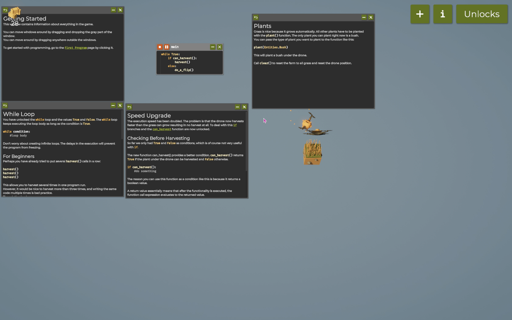

# Programming the Farming Drone (Report)

## Introduction

Briefly describe the game and the objective.
The Farmer Was Replacedis an interesting and fun programming automation game. In this game, a flying drone uses Python language to automate different farming task, which can often be repetitive and time-consuming. Players need to use programing langauge to control the drone to automate the farming task.

# Table of Contents

- [Code Snippets and Explanation](#code-snippets-and-explanation)
- [Challenges and Learnings](#challenges-and-learnings)
- [References](#references)

# Code-Snippets-and-Explanation

Write and explain your code along with recordings.

## Step 1: Farming on 1 tile

**Code:**
while True:
if can_harvest():
harvest()
else:
do_a_flip()

```

**Explanation:**
The provided code snippet creates an infinite loop that continuously checks if harvesting is possible using the can_harvest() function. If harvesting is possible (i.e., can_harvest() returns True), it calls the harvest() function to perform the harvesting action. If harvesting is not possible (i.e., can_harvest() returns False), it executes the do_a_flip() function, which likely triggers a playful animation or action. This structure allows a character or entity in a game or simulation to actively engage in harvesting crops when they are ready while performing an alternative action to maintain engagement when there is nothing to harvest. However, since the loop runs indefinitely, it may need an exit condition or a delay to prevent excessive resource consumption.

**Demo:**
Video Demo:

**Notes**
- Using the code above I was able to get enough hay to unlock the tile
- These features were unlocked too: Real-time harvesting capability.
Enhanced character interaction.
The necessity for potential exit conditions or delays to manage resource consumption effectively.

## Step 2: Farming on 3x3 tile
**Code:**
clear()
move(South)
while True:
    for i in rangelget_world_size());
        move (North)
        if can_harvest():
            harvest()
            if num_items(Items. Hay) < 600:
                plant (Entities.Grass)
             else:
                plant (Entities.Bush)
        move (East)

**Explanation:**
The provided code snippet begins by clearing the current state and moving the character south. It then enters an infinite loop that iterates over a range defined by the world's size. Within this loop, the character moves north and checks if harvesting is possible using the can_harvest() function. If harvesting is allowed, it executes the harvest() function. After harvesting, the code checks the number of hay items in the inventory; if there are fewer than 600, it plants grass, otherwise, it plants bushes. Finally, the character moves east before the loop repeats. This structure allows for continuous exploration and resource management, enabling the character to harvest, plant, and navigate the environment effectively. However, the code contains a syntax error in the for loop declaration, where rangelget_world_size() should likely be corrected to range(get_world_size()).
**Demo:**
Video Demo:

**Notes**
- Using the code above I was able to get enough hay to unlock the tile
- These features were unlocked too: variables and functions.
.
.
.
.
.
.
.
.
.
.
# Challenges and Learnings
## Challenges
In "The Farmer Was Replaced," players encounter several challenges primarily related to programming and automation. One of the main hurdles is the learning curve associated with grasping programming concepts, which can be particularly daunting for those without prior coding experience. As players progress, tasks become increasingly complex, requiring more sophisticated coding solutions, and balancing multiple farming activities simultaneously can be overwhelming. Efficient resource management is also crucial, as mismanagement can lead to inefficiencies and hinder progress. Players often face the challenge of debugging their code, which can be time-consuming and frustrating, especially when trying to identify and fix issues. Additionally, the need for continuous optimization puts pressure on players to refine their strategies repeatedly, which can be mentally taxing. These challenges contribute to the game's engaging yet demanding nature, making it a rewarding experience for those who enjoy problem-solving and coding.
## Learnings
Note down what different algorithms and methods of programming you learnt
- In "The Farmer Was Replaced," players can learn various algorithms and programming methods that enhance their problem-solving skills. Key concepts include looping, as players use loops to automate repetitive tasks like harvesting and planting. Conditional statements are crucial for making decisions based on inventory levels, such as choosing what to plant based on the quantity of hay. Players also explore function creation to encapsulate specific tasks, promoting code reusability and organization. Pathfinding algorithms can be applied to navigate the drone efficiently through the farm, while resource management techniques help optimize the use of materials and time. Overall, the game serves as a practical introduction to basic programming concepts and algorithms, fostering logical thinking and computational skills.

## References
List any resources, articles, or libraries you used or referenced while working on this project.
1. [https://youtu.be/9oUIS8qFBys?si=0IbSOeVZGLvsyiuQ](URL)
2. [https://youtu.be/p9B7MQ_42p8?si=9nPBrhsjkZT8uAVh](URL)
```
